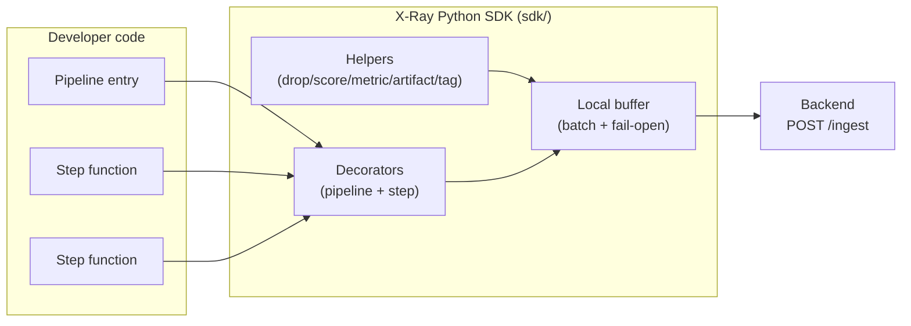
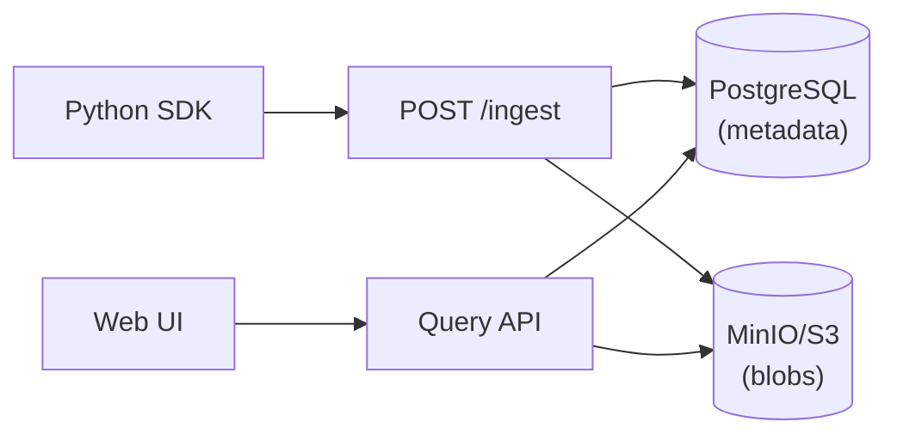
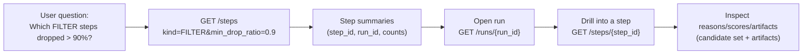

# X-Ray Architecture

---

## 1) System design (overall)

### Description (flow)

### 1. SDK

#### Diagram

#### Overview (how it’s used)

When a developer runs instrumented code, I treat that execution as a **Run** and each decorated stage as a **Step**. Inside steps, the developer can record decision context (drops + reasons, scores, metrics, and artifacts like LLM prompts/responses). The SDK buffers run/step events locally and flushes them in batches to `POST /ingest`, so the pipeline doesn’t pay network cost on every decision.

I designed the SDK to be **fail-open**: if the backend is slow or unavailable, I don’t block the pipeline. I treat observability as best-effort, not as a dependency.

#### SDK “tags” / surface area (what you can use, and why)

| SDK capability                                         | What it is               | Use case (what it gives you)                                                                   |
| ------------------------------------------------------ | ------------------------ | ---------------------------------------------------------------------------------------------- |
| `@xray.pipeline("name", ...)`                          | marks a pipeline entry   | creates a Run; you can filter runs by pipeline/version/tags and inspect input/output summaries |
| `@xray.step("KIND", ...)`                              | marks a decision stage   | creates a Step; enables cross-pipeline queries by kind (FILTER/RETRIEVE/RANK/LLM_CALL/...)     |
| `xray.drop(candidate, reason)`                         | record a drop decision   | powers `reason_histogram`, `top_dropped`, and drilldowns (why did we lose good candidates?)    |
| `xray.score(candidate, value)`                         | record a score           | powers `score_histogram`, “top kept”, and debugging “why did this rank high?”                  |
| `xray.metric(key, value)`                              | structured step metadata | capture thresholds, latencies, model name, retries; useful for filtering and comparison        |
| `xray.artifact(type, content)`                         | attach a debug payload   | store prompts/responses/config/errors; lets you inspect non-deterministic steps                |
| `xray.tag(key, value)`                                 | attach run tags          | slice runs by cohort (env, customer, experiment, query); makes “find the bad run” faster       |
| `xray.set_input_count(n)` / `xray.set_output_count(n)` | manual counts            | use when inputs/outputs are not list-based (single item flows, generators, streaming)          |
| `xray.init(...)` / env vars                            | configure SDK behavior   | set endpoint, disable tracing, sampling, batching, and top-k capture size                      |

#### SDK configuration knobs (reqs)

| Config                | Where                                 |                 Default | Why you use it                                         |
| --------------------- | ------------------------------------- | ----------------------: | ------------------------------------------------------ |
| `XRAY_ENDPOINT`       | env / `xray.init(endpoint=...)`       | `http://localhost:8000` | point SDK at the backend                               |
| `XRAY_DISABLED`       | env / `xray.init(disabled=...)`       |                 `false` | disable tracing without code changes                   |
| `XRAY_SAMPLE_RATE`    | env / `xray.init(sample_rate=...)`    |                   `1.0` | control cost by sampling runs                          |
| `XRAY_BATCH_SIZE`     | env / `xray.init(batch_size=...)`     |                    `10` | reduce HTTP overhead by batching                       |
| `XRAY_FLUSH_INTERVAL` | env / `xray.init(flush_interval=...)` |                  `1.0s` | control how quickly events appear in UI                |
| `XRAY_TOP_K`          | env / `xray.init(top_k=...)`          |                    `10` | control how many “top kept/dropped” samples are stored |

#### Key decisions I made (and why)

- **Decorator-first API**: I chose decorators because it’s the lowest-friction way to retrofit an existing pipeline. The developer mostly “marks” functions, instead of threading a context object everywhere.
- **Run/Step model (not spans)**: I modeled “decision stages” explicitly because the core questions are about candidate decisions and reasoning, not call graphs.
- **Fail-open + background flush**: I chose best-effort delivery to avoid observability breaking production. Data might be dropped under extreme overload, but the pipeline keeps running.
- **Batching**: I batch to reduce per-step cost. Many pipelines can emit lots of steps; sending each step synchronously would be too expensive.
- **Top-k capture**: I store histograms + top samples by default because full candidate capture does not scale. `XRAY_TOP_K` is the main knob to trade off cost vs visibility.
- **Stable candidate identity**: I assume a stable id field (default `id`). Without stable ids, drops/scores/traces become unreliable.

#### Possible alternatives (and trade-offs)

- **Context managers instead of decorators**: explicit and flexible, but more boilerplate (harder retrofit).
- **Always capture full candidate lists**: simplest semantics, but becomes unusable at 5k+ candidates (memory, network, storage).
- **Send synchronously on every step**: easiest to reason about delivery, but increases pipeline latency and fragility.
- **OpenTelemetry spans**: good for infra tracing, but does not naturally represent candidate-level decisions; you still end up inventing a candidate model.

#### Then: backend + storage (high-level, without internal details)

On the backend, ingest is treated as a fast “accept and persist later” path. The backend ultimately stores **queryable metadata** in Postgres and **large payloads** (candidate sets + artifact bodies) in MinIO. The UI only pulls blobs when a screen needs them (step detail, candidates, artifacts).

#### Finally: web tools + how queryability works

The UI is built around these query patterns: find the suspicious run/step using small indexed fields (kind, counts, status), and only then drill into detailed blobs to answer “why”.

### Decisions (long bullets)

- **Runs and steps are first-class**: I model debugging around decision stages (retrieve, filter, rank, LLM, judge) instead of function-level spans, because the debugging questions are about candidate decisions and reasoning.
- **Metadata vs blobs split**: I store queryable fields (run/step ids, timestamps, kinds, counts, status, metrics) in Postgres. I store large payloads (candidate sets and artifacts) in MinIO and reference them from metadata. This keeps queries fast and storage costs sane.
- **Redis queue for ingest**: I queue writes because ingest is write-heavy and bursty. The ingest endpoint stays fast and predictable, and persistence happens asynchronously.
- **Redis cache for reads**: I cache hot query results (run lists, run detail, step detail) to keep UI interactions snappy.
- **Candidate summaries over full capture**: I prefer histograms + top samples (top kept / top dropped) over storing all candidates by default, because full capture is expensive at scale.
- **Fail-open SDK**: the SDK should not break production pipelines if the backend is unavailable. It buffers and retries without blocking the main flow.
- **Cross-pipeline queryability via step kind**: I use a small controlled vocabulary for step kinds (FILTER, RETRIEVE, etc.) so queries like “FILTER dropped > 90%” work across different pipelines.

### Alternatives (and why I didn’t pick them)

- **Everything in Postgres JSON**: simple at first, but large candidate payloads bloat the DB and make queries slow. You end up duplicating derived fields anyway.
- **Everything in object storage**: cheap storage, but terrible queryability. The UI would require scanning blobs, which is not interactive.
- **Traditional tracing spans only**: good for latency debugging, but doesn’t model candidate decisions, drop reasons, or LLM artifacts in a way that answers “why”.

---

## 2) SERVER

### APIs (table)

| Method | Path                          | What it does                            | Request params/body (high level)                                                   | Response (high level)                                            |
| ------ | ----------------------------- | --------------------------------------- | ---------------------------------------------------------------------------------- | ---------------------------------------------------------------- |
| POST   | `/ingest`                     | Ingest run + step events (queued)       | Body: `{ schema_version, runs?: Run[], steps?: Step[] }`                           | `{ accepted_runs, accepted_steps, queued }`                      |
| GET    | `/ingest/stats`               | Ingest queue stats                      | —                                                                                  | `{ queue_length, processed_runs, processed_steps, errors, ... }` |
| GET    | `/runs`                       | List/search runs                        | Query: `pipeline_name?`, `status?`, `start_time?`, `end_time?`, `limit`, `offset`  | `RunSummary[]`                                                   |
| GET    | `/runs/{run_id}`              | Run detail + step timeline              | Path: `run_id`                                                                     | `{ run, steps[] }`                                               |
| GET    | `/runs/{run_id}/trace`        | Trace a candidate through a run         | Query: `q` (id/name/title search)                                                  | `{ found, journey[] }`                                           |
| GET    | `/steps`                      | List/search steps                       | Query: `kind?`, `run_id?`, `min_drop_ratio?`, `max_drop_ratio?`, `limit`, `offset` | `StepSummary[]`                                                  |
| GET    | `/steps/{step_id}`            | Step detail + candidate set + artifacts | Path: `step_id`                                                                    | `{ step, candidate_set?, artifacts? }`                           |
| GET    | `/steps/{step_id}/candidates` | Raw candidate set blob                  | Path: `step_id`                                                                    | CandidateSet blob (or message)                                   |
| GET    | `/compare`                    | Compare two runs                        | Query: `run_id_a`, `run_id_b`                                                      | comparison payload (runs + step diffs)                           |
| GET    | `/health`                     | Health check                            | —                                                                                  | `{ status, version, queue_length }`                              |

### How things work (para)

On ingest, I do not write to the database inline. I enqueue the payload to Redis and return, so ingest stays low-latency. A background worker drains the queue in batches, writes run/step metadata to Postgres, writes candidate sets and artifact payloads to MinIO, and invalidates caches. On queries, I check Redis cache first; on a miss I query Postgres, and if blob-backed content is required (candidate sets, artifact content) I load it from MinIO.

---

## 3) SDK

### Architecture (para)

I provide a decorator-based SDK because it minimizes code changes. `@xray.pipeline` creates a run context. `@xray.step` creates a step context linked to the current run. Inside a step, helpers like `xray.drop` and `xray.score` enrich the candidate set, and `xray.artifact` captures LLM prompts/responses/configs. Events are buffered in-process and flushed in batches to the backend.

### Considerations (long bullets)

- **Fail-open**: if the backend is down, I keep the pipeline running. I treat observability as best-effort, not a dependency.
- **Batching**: I batch events to reduce per-step overhead and to avoid spamming the backend.
- **Sampling**: I support sampling runs via `XRAY_SAMPLE_RATE` so teams can control cost.
- **Top-k candidate capture**: I cap sample capture via `XRAY_TOP_K` / `xray.init(top_k=...)` so the UI stays useful without storing massive candidate payloads.
- **Stable candidate identity**: I assume candidates have stable ids (default field `id`). This is important for drop reasons, scores, and candidate trace.

### How a developer uses it (minimal → full)

Minimal:

- call `xray.init()`
- decorate pipeline entry with `@xray.pipeline("name")`
- decorate main stages with `@xray.step("KIND")`

Full (for “why” debugging):

- record drops: `xray.drop(candidate, "reason")`
- record scores: `xray.score(candidate, value)`
- attach artifacts: `xray.artifact("prompt", ...)`, `xray.artifact("response", ...)`
- add metrics/tags: `xray.metric(...)`, `xray.tag(...)`

### SDK requirements (env + init)

| Config                | Where                                 |            Type |                 Default | What it affects              |
| --------------------- | ------------------------------------- | --------------: | ----------------------: | ---------------------------- |
| `XRAY_ENDPOINT`       | env / `xray.init(endpoint=...)`       |          string | `http://localhost:8000` | Backend base URL             |
| `XRAY_DISABLED`       | env / `xray.init(disabled=...)`       |            bool |                 `false` | Turns tracing on/off         |
| `XRAY_SAMPLE_RATE`    | env / `xray.init(sample_rate=...)`    |    float (0..1) |                   `1.0` | Run sampling                 |
| `XRAY_BATCH_SIZE`     | env / `xray.init(batch_size=...)`     |             int |                    `10` | Flush batch size             |
| `XRAY_FLUSH_INTERVAL` | env / `xray.init(flush_interval=...)` | float (seconds) |                   `1.0` | Flush cadence                |
| `XRAY_TOP_K`          | env / `xray.init(top_k=...)`          |             int |                    `10` | Top kept/dropped sample size |

---

## 4) Walkthrough (how I debug)

If I get a bad match (phone case matched to laptop stand), I debug in this order:

First I open the run and confirm the bad output via `final_output` and the request context via `input_summary`.

Next I scan the step timeline and look for the “first suspicious step” using input/output counts, drop ratio, and duration. A filter step dropping 95% is usually a clue. A rank/judge step with strange output counts or long duration is another clue.

Then I open that step and inspect the candidate set. I look at `reason_histogram` to see which rules dominated. I look at `top_dropped` to find good candidates that were eliminated and what reasons they got. If the issue is ranking, I look at `score_histogram` and `top_kept` to see if irrelevant items are scoring high.

Then I use candidate trace (`/runs/{run_id}/trace?q=...`) to see where the laptop stand was dropped and where the phone case was kept. This tells me if the bad candidate was introduced during retrieval or selected later due to ranking/judging.

Finally, for LLM steps I inspect artifacts (prompt/response) and step metrics (model/temperature) to see whether the reasoning stage drifted.
