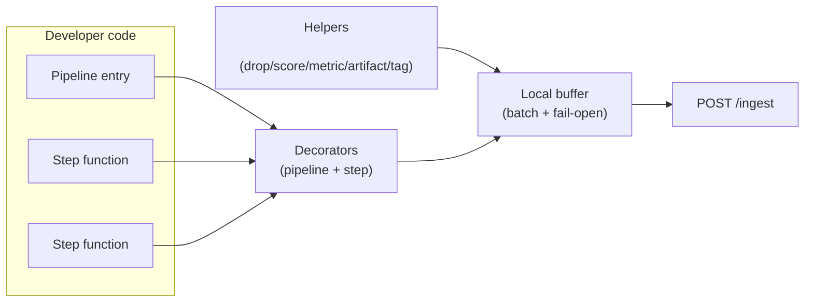
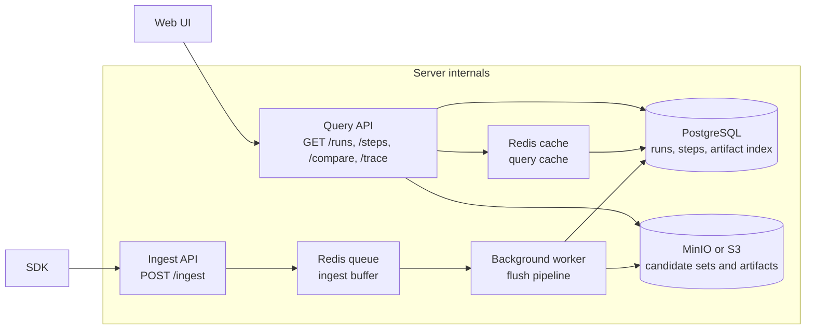

# X-Ray Architecture

---

## 1. SDK

When a developer runs instrumented code, I treat that execution as a **Run** and each decorated stage as a **Step**. Inside steps, the developer can record decision context (drops + reasons, scores, metrics, and artifacts like LLM prompts/responses). The SDK buffers run/step events locally and flushes them in batches to `POST /ingest`, so the pipeline doesn’t pay network cost on every decision.

I designed the SDK to be **fail-open**: if the backend is slow or unavailable, I don’t block the pipeline. I treat observability as best-effort, not as a dependency.

#### <u>SDK Components</u>

| SDK capability                                         | What it is               | Use case (what it gives you)                                                                   |
| ------------------------------------------------------ | ------------------------ | ---------------------------------------------------------------------------------------------- |
| `@xray.pipeline("name", ...)`                          | marks a pipeline entry   | creates a Run; you can filter runs by pipeline/version/tags and inspect input/output summaries |
| `@xray.step("KIND", ...)`                              | marks a decision stage   | creates a Step; enables cross-pipeline queries by kind (FILTER/RETRIEVE/RANK/LLM_CALL/...)     |
| `xray.drop(candidate, reason)`                         | record a drop decision   | powers `reason_histogram`, `top_dropped`, and drilldowns (why did we lose good candidates?)    |
| `xray.score(candidate, value)`                         | record a score           | powers `score_histogram`, “top kept”, and debugging “why did this rank high?”                  |
| `xray.metric(key, value)`                              | structured step metadata | capture thresholds, latencies, model name, retries; useful for filtering and comparison        |
| `xray.artifact(type, content)`                         | attach a debug payload   | store prompts/responses/config/errors; lets you inspect non-deterministic steps                |
| `xray.tag(key, value)`                                 | attach run tags          | slice runs by cohort (env, customer, experiment, query); makes “find the bad run” faster       |
| `xray.set_input_count(n)` / `xray.set_output_count(n)` | manual counts            | use when inputs/outputs are not list-based (single item flows, generators, streaming)          |
| `xray.init(...)` / env vars                            | configure SDK behavior   | set endpoint, disable tracing, sampling, batching, and top-k capture size                      |

#### SDK configuration knobs (reqs)

| Config                | Where                                 |                 Default | Why you use it                                         |
| --------------------- | ------------------------------------- | ----------------------: | ------------------------------------------------------ |
| `XRAY_ENDPOINT`       | env / `xray.init(endpoint=...)`       | `http://localhost:8000` | point SDK at the backend                               |
| `XRAY_DISABLED`       | env / `xray.init(disabled=...)`       |                 `false` | disable tracing without code changes                   |
| `XRAY_SAMPLE_RATE`    | env / `xray.init(sample_rate=...)`    |                   `1.0` | control cost by sampling runs                          |
| `XRAY_BATCH_SIZE`     | env / `xray.init(batch_size=...)`     |                    `10` | reduce HTTP overhead by batching                       |
| `XRAY_FLUSH_INTERVAL` | env / `xray.init(flush_interval=...)` |                  `1.0s` | control how quickly events appear in UI                |
| `XRAY_TOP_K`          | env / `xray.init(top_k=...)`          |                    `10` | control how many “top kept/dropped” samples are stored |

#### <u>Key decisions (and why)</u>

The SDK is designed around a decorator-first integration model because it minimizes retrofit cost for existing codebases. Pipelines can be instrumented by marking entrypoints and stages rather than passing explicit context through every function.

The event model is centered on Run and Step because the debugging questions are decision oriented. This structure supports candidate level visibility with drops, scores, artifacts, and step metrics instead of only call timing.

Delivery is fail open and batch oriented. Events are buffered and flushed asynchronously so the pipeline does not pay network cost on every decision and does not fail when the backend is unavailable. Candidate capture defaults to summarized outputs with a configurable top k limit so visibility is preserved without storing full candidate lists. Candidate identity is expected to be stable, usually the `id` field, so drops, scores, and trace remain consistent.

#### <u>Possible alternatives (and trade-offs)</u>

Context managers can replace decorators and provide explicit scoping, but they typically add more boilerplate and reduce adoption for existing pipelines.

Full candidate capture provides maximum completeness, but it does not scale for large candidate sets due to memory, network, and storage costs.

Synchronous sends on every step simplify delivery semantics, but they increase tail latency and make production pipelines sensitive to backend availability.

Span based tracing improves latency visibility, but it does not directly represent candidate decisions and usually still requires a separate decision model to answer why questions.

## 2) SERVER

#### Diagram (high-level)

#### Overview

The server has two jobs: 
1. accept ingest events from the SDK, and 
2. serve query endpoints to the UI. I keep ingest fast by queueing writes, and I keep queries fast by caching and by separating metadata (Postgres) from blobs (MinIO).

### APIs (table)

| Method | Path                          | What it does                            | Request params/body (high level)                                                   | Response (high level)                                            |
| ------ | ----------------------------- | --------------------------------------- | ---------------------------------------------------------------------------------- | ---------------------------------------------------------------- |
| POST   | `/ingest`                     | Ingest run + step events (queued)       | Body: `{ schema_version, runs?: Run[], steps?: Step[] }`                           | `{ accepted_runs, accepted_steps, queued }`                      |
| GET    | `/ingest/stats`               | Ingest queue stats                      | —                                                                                  | `{ queue_length, processed_runs, processed_steps, errors, ... }` |
| GET    | `/runs`                       | List/search runs                        | Query: `pipeline_name?`, `status?`, `start_time?`, `end_time?`, `limit`, `offset`  | `RunSummary[]`                                                   |
| GET    | `/runs/{run_id}`              | Run detail + step timeline              | Path: `run_id`                                                                     | `{ run, steps[] }`                                               |
| GET    | `/runs/{run_id}/trace`        | Trace a candidate through a run         | Query: `q` (id/name/title search)                                                  | `{ found, journey[] }`                                           |
| GET    | `/steps`                      | List/search steps                       | Query: `kind?`, `run_id?`, `min_drop_ratio?`, `max_drop_ratio?`, `limit`, `offset` | `StepSummary[]`                                                  |
| GET    | `/steps/{step_id}`            | Step detail + candidate set + artifacts | Path: `step_id`                                                                    | `{ step, candidate_set?, artifacts? }`                           |
| GET    | `/steps/{step_id}/candidates` | Raw candidate set blob                  | Path: `step_id`                                                                    | CandidateSet blob (or message)                                   |
| GET    | `/compare`                    | Compare two runs                        | Query: `run_id_a`, `run_id_b`                                                      | comparison payload (runs + step diffs)                           |
| GET    | `/health`                     | Health check                            | —                                                                                  | `{ status, version, queue_length }`                              |

On ingest, I do not write to the database inline. I enqueue the payload to Redis and return, so ingest stays low-latency. A background worker drains the queue in batches, writes run/step metadata to Postgres, writes candidate sets and artifact payloads to MinIO, and invalidates caches. On queries, I check Redis cache first; on a miss I query Postgres, and if blob-backed content is required (candidate sets, artifact content) I load it from MinIO.

#### Why I use blobs (MinIO/S3) for candidate sets and artifacts ?

I store **candidate sets** and **artifact bodies** as blobs because they can be large and unpredictable in size. A single step can see thousands of candidates, and LLM artifacts (prompts/responses) can also be big. If I stored these directly in Postgres as JSON, Postgres would become my bottleneck: rows get huge, indexes get expensive, queries slow down, and retention becomes painful.

Instead, I keep Postgres for what it’s good at: **small, indexed, queryable metadata** (run/step ids, timestamps, status, kind, counts, metrics, and an artifact index). Then I put the heavy payloads in MinIO/S3 and reference them from the step via a blob ref. This keeps list pages and filters fast (they hit Postgres), and only loads big blobs when a user actually drills into a step detail or artifact view in the UI.

#### Role of Redis 

Redis serves two critical functions in this architecture:

1. **Ingest Queue**: When the SDK or client sends an ingest request (`POST /ingest`), the server quickly validates and pushes the event payload onto a Redis queue. This lets the API respond almost instantly by offloading persistence to a background worker that drains the queue in batches and writes to Postgres/MinIO. Using Redis for this queue guarantees low-latency ingestion and helps absorb bursts of ingest load without overwhelming the DB or blocking clients.

2. **Query Cache**: For frequent query endpoints (like `GET /runs` or step/run details), Redis is used as an in-memory cache layer. Query results are cached with stable keys and invalidated when underlying data changes—typically after a batch write by the ingest worker. This drastically reduces database load and keeps UI interactions snappy even when demand is high.

**Why Redis?**
Redis is used because it offers a fast, in-memory foundation for both queueing ingest events and caching query results, combining high throughput with operational simplicity. Its support for multiple data structures (lists, sets, hashes) allows efficient handling of both batched writes and fast lookups, while persistence features (AOF/RDB) are adequate for staging transient data—accepting minimal data loss in exchange for reduced complexity. This lets Redis serve simultaneously as a quick ingest buffer and a low-latency cache, ensuring the system stays responsive even under heavy load.

While the current architecture leverages Redis for both ingest queueing and query caching, and MinIO/S3 for large blobs, there are other architectures that could be considered depending on priorities such as durability, operational complexity, and scalability:

Instead of Redis, message brokers like Kafka, NATS, or RabbitMQ can provide stronger guarantees for queue durability, ordering, and throughput at very large scale. They increase operational complexity and require careful management, but are well-suited for environments with very high ingest rates or strict delivery requirements.

Some systems use a dedicated write-ahead log, or even leverage PostgreSQL's LISTEN/NOTIFY or a separate events table as the queue. This simplifies the stack but may cause database contention or reduce ingest throughput during spikes.

Ultimately, the chosen architecture reflects a trade-off: Redis and MinIO are lightweight and easy to operate
---

## 3) Dashboard (UI)

#### What exists on the dashboard today

When I say “dashboard”, I mean the **Runs** screen in the web UI. It’s the entry point for debugging.

It provides:

1. **Run-level metadata + triage controls**: runs table (run id, pipeline, status, step count, duration, started time) with status filters and pagination.
2. **Pipeline data per step**: per-run step timeline with step kind/name, input/output counts, drop ratio, duration, and status.
3. **Candidate set analytics**: reason histogram + score histogram, top kept/top dropped tables, and dropped-by-reason drilldowns (when captured).
4. **Artifacts inspection**: prompt/response/config/error/debug payloads attached to steps, with expand/collapse for large content.
5. **Candidate trace**: search a candidate id/name/title inside a run to see its journey (kept vs dropped) and the drop reason when applicable.
6. **Compare view (same process across runs/pipelines)**: compare multiple runs to spot diffs in step counts, drop ratios, candidate samples, and artifacts.

We can use the dashboard in two common debugging modes:

**Case 1: Debug a particular candidate**

If we already know the problematic item (candidate id, title, or name), we open the run and use **Candidate Trace** (`GET /runs/{run_id}/trace?q=...`).

We expect the trace to return a step-by-step journey:

- which steps the candidate appeared in
- whether it was **kept** or **dropped**
- the **drop reason** (when available)
- the candidate payload snapshot (top-kept/top-dropped context)

This is the fastest way to answer: “where did this candidate get eliminated?” or “why did this candidate survive until selection?”

**Case 2: Debug overall results**

If we don’t know a specific candidate and we’re debugging the overall output quality, we start from the run’s **step timeline** and look for anomalies:

- high **drop ratio** steps (e.g., FILTER dropping 90%+)
- unexpected **input/output** counts (sudden shrink or explosion)
- unusually high **duration** steps (often LLM/tool calls)

Then we drill into the suspicious step detail and inspect:

- `reason_histogram` to see dominant elimination rules
- `score_histogram` to see score distribution issues
- `top_kept` / `top_dropped` samples to validate decision quality
- artifacts (prompt/response/config/error) for non-deterministic stages

If this is a regression, we use **Compare** to diff two runs and identify which step’s counts/reasons/samples changed.
