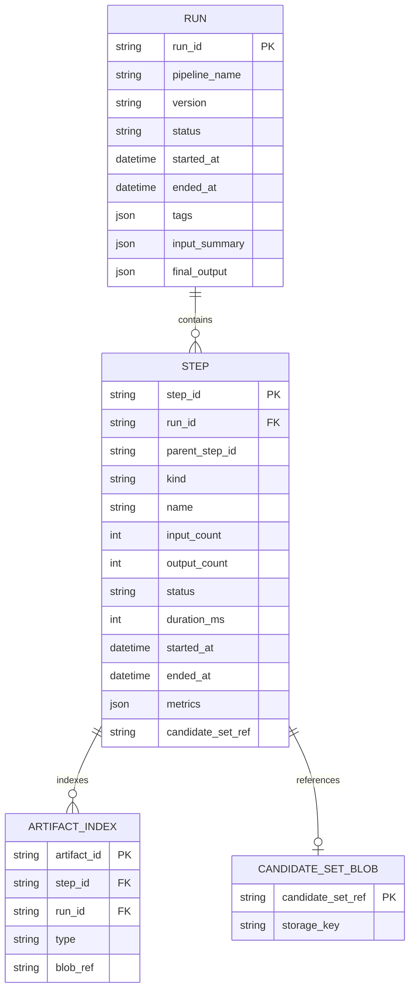
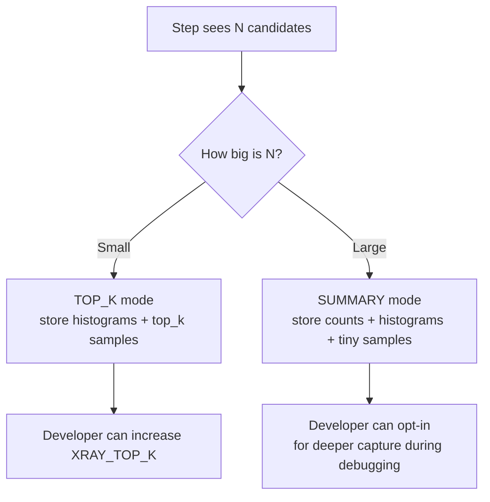
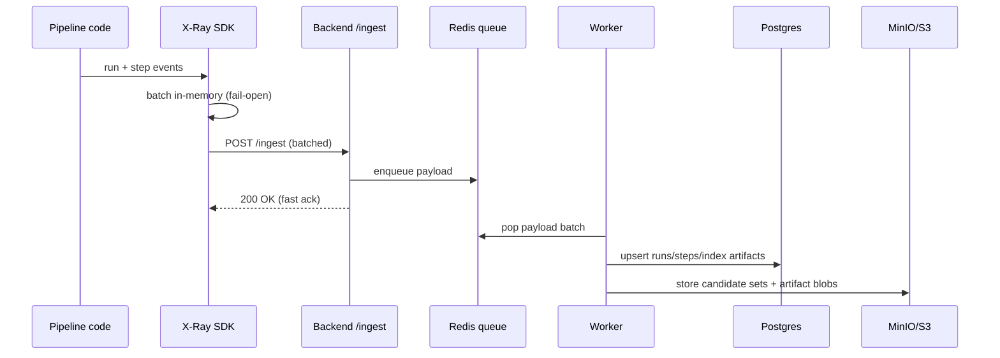

# Founding Full-Stack Engineer - Take-Home Assignment

## Overview

I built an **X-Ray system** to debug multi-step, non-deterministic decision pipelines. The goal is to make it easy to answer “why did we pick this output?” by capturing what happened at each step: what candidates came in, what got dropped (and why), what got kept, and what reasoning/artifacts drove the decision.

I’m not trying to replace distributed tracing. I’m solving a different debugging problem: tracing explains function timing; X-Ray explains business logic decisions.

---

## The Problem

When a pipeline’s final result is wrong, it’s usually unclear where the failure happened. It could be the retrieval step bringing noisy candidates, the filter step being too strict, the ranking step scoring the wrong items, or an LLM step generating bad intermediate reasoning. Traditional logs tell me what executed, but they rarely give me the candidate-level story.

In the example from the prompt (a **phone case** matched to a **laptop stand**), the thing I want is not just a stack trace. I want evidence like: “the laptop stand was dropped in FILTER because category mismatch was too strict” or “the LLM generated irrelevant keywords that pulled phone accessories into the candidate pool.”

---

## My Task

I built an X-Ray system with:

1. A **Python SDK** developers add to their pipeline code
2. A **backend API** to ingest and query X-Ray data
3. A **UI** to browse runs, drill into steps, and trace candidates

This document explains the architecture and trade-offs in the same structure as the take-home.

### System map (interactive)

```mermaid
flowchart LR
  subgraph SDK[Python SDK (sdk/)]
    A[@pipeline/@step + helpers]
    B[In-process buffer\n(batch + fail-open)]
  end

  subgraph Backend[FastAPI Backend (server/)]
    C[POST /ingest]
    D[Redis queue\n(write buffer)]
    E[Worker\nflush to storage]
    F[Query API\nGET /runs,/steps,...]
    G[Redis cache\n(read cache)]
  end

  subgraph Storage[Storage]
    P[(PostgreSQL\nruns/steps/artifact index)]
    S[(MinIO/S3\ncandidate sets + artifact blobs)]
  end

  subgraph UI[React UI (client/)]
    U[Runs / Run Detail / Step Detail\nCompare / Trace]
  end

  A --> B --> C --> D --> E
  E --> P
  E --> S
  U --> F
  F --> G
  F --> P
  F --> S
```

---

## Core Design (required)

### Data Model Rationale

I modeled the world around four concepts: **Run**, **Step**, **CandidateSet**, and **Artifact**.

A **Run** is one execution of a pipeline. It carries identity (`run_id`, pipeline name/version), status/timestamps, tags for filtering, and small JSON summaries (`input_summary`, `final_output`). I keep run summaries small because I want run listing and run detail screens to load fast without pulling large blobs.

A **Step** is one stage inside a run. It stores the most queryable fields: step kind/name, timing, status, input/output counts, and metrics. This is the metadata I want indexed and filterable (e.g., “filter steps that dropped > 90%”). Steps also point to “big data” by reference rather than embedding it inline.

A **CandidateSet** is the decision payload for a step. It contains counts plus debugging-friendly summaries:

- `reason_histogram`: aggregated drop reasons
- `score_histogram`: distribution of scores
- `top_kept` and `top_dropped`: sample candidates
- optional drilldown: `dropped_by_reason`

An **Artifact** is an attached debug payload like an LLM prompt/response, config snapshot, or error. I store the artifact content as a blob, but I also index artifacts by run/step/type so I can retrieve them quickly and later support richer queries.

The most important structural choice I made is **separating metadata from large payloads**:

- I store **Run/Step metadata** in **PostgreSQL** because I need fast querying, filtering, and pagination.
- I store **CandidateSets and Artifacts** in **MinIO (S3)** because these payloads can be large and shouldn’t bloat the database.
- I use **Redis** for two reasons: (1) a write buffer (ingest queue) and (2) a read cache for hot queries.

This is why I structured it this way: Postgres gives queryability; object storage gives cheap blobs; Redis smooths write spikes and accelerates reads.

### Data model diagram (interactive)



#### Alternatives I considered

If I stored candidate sets directly in Postgres JSON columns, I would quickly make Postgres the bottleneck. Large JSON rows slow down queries, indexing becomes expensive, and retention becomes painful. I’d also end up duplicating derived fields anyway (counts, drop ratio) to make queries workable.

If I stored everything only in object storage, queryability would be weak. The UI would be forced to scan blobs to find runs/steps of interest, which doesn’t scale and feels slow.

If I tried to model this as “spans” (traditional tracing), I would still need a first-class representation of candidate decisions and drop reasons. Spans aren’t designed for “why” at the candidate level, so I chose a domain model that matches the debugging questions.

### Debugging Walkthrough (required)

If a competitor selection run returns a bad match (phone case matched to laptop stand), here is how I would debug it using my X-Ray system.

First I open the **run detail** page for that run. I inspect `input_summary` and `final_output` to confirm the wrong match and understand the request context (seller product, constraints, etc.).

Next I scan the **step timeline**. For each step I check input/output counts and drop ratio. A step with a very high drop ratio (for example, FILTER dropping 95%) is a strong clue. I also look at step duration; a slow LLM step can imply retries or instability.

Then I open the suspicious step and look at its **candidate set**. I start with `reason_histogram`. If it’s dominated by a reason that looks wrong (like “category_mismatch”), I know which rule family to inspect. I look at `top_dropped` to see concrete examples of good candidates that were eliminated. If laptop stands are present there, I look at the drop reason and understand what eliminated them.

If the issue is ranking/judging, I look at the `score_histogram` and `top_kept`. If irrelevant items are getting high scores, it’s a scoring or judging failure. At that point, I check **artifacts** for the LLM steps: prompt and response, plus metrics like model name and temperature. That often reveals prompt drift or a mismatched evaluation rubric.

Finally, I use **candidate trace**. I search for the laptop stand candidate (by id/name/title) and see exactly which step dropped it and why. I also search for the phone case and see where it was kept. This tells me whether the bad candidate was introduced during retrieval or surfaced later due to ranking/judge logic.

The result is that I can point to the failing stage with evidence, not guesswork.

### Debugging flow (interactive)

```mermaid
flowchart TD
  A[Bad final output\n(phone case vs laptop stand)] --> B[Open Run Detail]
  B --> C[Scan step timeline\n(counts, drop ratio, duration)]
  C --> D{Which stage looks wrong?}
  D -->|Retrieve noisy| E[Open RETRIEVE step\ninspect top_kept/top_dropped]
  D -->|Filter too strict| F[Open FILTER step\nreason_histogram + top_dropped]
  D -->|Ranking/judge weird| G[Open RANK/JUDGE\nscore_histogram + artifacts]
  E --> H[Trace candidate\nif needed]
  F --> H
  G --> H
  H --> I[Fix logic/prompt/threshold\nre-run and compare]
```

---

## Queryability

The prompt asks: “show me all runs where the filtering step eliminated more than 90% of candidates” across different pipelines.

I designed for this by requiring every step to have a **Step Kind** from a small controlled vocabulary (RETRIEVE, FILTER, RANK, LLM_CALL, JUDGE, SELECT, etc.). The step also has a free-form `name` for pipeline-specific meaning, but `kind` is what makes cross-pipeline queries possible.

I also store `input_count` and `output_count` directly on the step. That means drop ratio is queryable without loading any blobs. So the query becomes: find all steps where `kind=FILTER` and drop ratio > 0.9, then follow `run_id` to the run.

The constraint I impose is: developers should choose an appropriate `kind` for each step. The benefit is: I can run consistent queries across pipelines and still keep step names free-form for readability.

### Queryability (interactive)

```mermaid
flowchart LR
  A[Question:\n\"Filter eliminated >90%\"] --> B[Query Steps:\nkind=FILTER AND drop_ratio>0.9]
  B --> C[Return StepSummaries\n(step_id, run_id, counts)]
  C --> D[Fetch Run Detail\n/runs/{run_id}]
  D --> E[Inspect candidate set\nand artifacts for that run]
```

---

## Performance & Scale

The hard case is a step that takes 5,000 candidates and outputs 30. Capturing full candidate details (including all drop reasons) can be too expensive in memory, network, and storage.

I handle this by separating “what must be queryable” from “what is useful to debug.” I always store counts (`input_count`, `output_count`) and I store histograms (`reason_histogram`, `score_histogram`) because those are compact. Then I store a small number of concrete examples (`top_kept`, `top_dropped`) because examples are what humans debug with.

I made **top-k** configurable, because the right sample size differs by team and use case. A developer can set it via env or `xray.init(top_k=...)`.

Today, I still have a gap I would fix next: in the decorator capture path, if a developer passes a massive list, I can hold too much in memory before summarizing. The next step is to add hard safeguards: automatically switch to SUMMARY mode above a threshold, cap `dropped_by_reason` samples per reason, and add candidate sampling strategies (uniform sample + top-k by score).

I view this as a trade-off: I want safe defaults for production, but I also want the ability to dial up detail during a debugging session.

### Capture strategy (interactive)



---

## Developer Experience

### (a) Minimal instrumentation

The smallest useful integration is: call `xray.init()`, decorate the pipeline entry point with `@xray.pipeline(...)`, and decorate major stages with `@xray.step(...)`. If the developer’s steps take lists and return lists, I automatically capture input/output counts and step durations. That already shows where drops and latency happen.

### (b) Full instrumentation

Full value comes from recording decision context:

I call `xray.drop(candidate, "reason")` whenever I eliminate a candidate. I call `xray.score(candidate, value)` whenever I assign a score. I attach prompts/responses/configs with `xray.artifact(...)`. I record structured metadata with `xray.metric(...)` and `xray.tag(...)`.

That gives me histograms, drilldowns, and artifacts that make “why” analysis possible.

### (c) Backend unavailable

I designed the SDK to be fail-open. It batches events locally and sends them asynchronously. If the backend is down, the pipeline continues running. This is necessary for real production adoption.

### Ingest path (interactive)



---

## Real-World Application (optional)

In systems I’ve worked on, the hardest debugging issues usually come from “silent logic failures”: retrieval gets slightly worse over time, or a filter rule changes and silently drops too much, or an LLM prompt tweak changes ranking behavior. In those cases, what I want is exactly what X-Ray stores: candidate counts, drop reasons, score distributions, and the prompt/response artifacts that explain model behavior.

If I were retrofitting X-Ray into such a system, I would start with minimal instrumentation (run + step timeline), then add drops/scores and artifacts only for the steps where decisions matter most (filters, rankers, LLM judges).

---

## What Next??

If I were shipping this as a real product, my next focus areas would be:

I would improve schema evolution. I have a `schema_version`, but I would add explicit backward compatibility rules for blob formats and versioned decoders so old candidate sets remain readable.

I would add multi-tenancy and auth so teams and projects are isolated, with RBAC for viewing and deletion.

I would add retention policies for cost control: TTL on Postgres metadata and MinIO lifecycle rules for blobs.

I would add idempotency/deduplication. With async queues you often have at-least-once semantics, so I would introduce stable event IDs and idempotent writes.

I would expand queryability: indexes on tags, selected metrics, and richer step filters. I would also add candidate-level queries when needed (with careful cost control).

I would add capture safeguards for large inputs: auto SUMMARY mode, sampling, and hard caps to prevent accidental huge payloads.

I would scale the worker with multiple consumers and consider Redis Streams with consumer groups for better distribution and backpressure.

---

## Brief API Spec

### Ingest

`POST /ingest` accepts a payload with `schema_version` plus optional arrays of `runs` and `steps`. The backend acknowledges quickly and queues the payload for async persistence.

### Query

The query surface includes:

- `GET /runs` (filters + limit/offset)
- `GET /runs/{run_id}` (run + step timeline)
- `GET /steps` (filters like kind + drop ratio + run_id)
- `GET /steps/{step_id}` (step + candidate set + artifacts)
- `GET /runs/{run_id}/trace?q=...` (candidate trace)
- `GET /compare?run_id_a=...&run_id_b=...`

---

## Implementation Map (quick)

SDK: `sdk/xray/` (notably `decorators.py`, `context.py`, `client.py`, `config.py`)  
Backend: `server/app/` (notably `ingest.py`, `worker.py`, `db.py`, `blob_store.py`, `routes.py`)  
UI: `client/src/pages/` and `client/src/api.ts`  
Infra: `docker-compose.yml`
