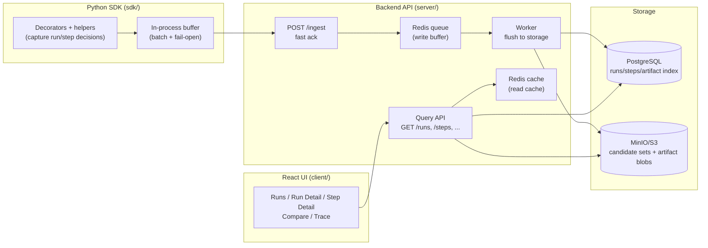

# X-Ray Architecture

---

## 1) System design (overall)

### Diagram

### Description (para)

I treat one pipeline execution as a **Run** and each decision stage as a **Step**. The SDK captures runs/steps and sends events to the backend. The backend acknowledges quickly by queueing ingest into Redis, then a worker persists metadata to Postgres and stores large payloads (candidate sets and artifacts) in MinIO. The UI reads via the query API and the backend uses Redis caching for fast read paths.

### Decisions (long bullets)

- **Runs and steps are first-class**: I model debugging around decision stages (retrieve, filter, rank, LLM, judge) instead of function-level spans, because the debugging questions are about candidate decisions and reasoning.
- **Metadata vs blobs split**: I store queryable fields (run/step ids, timestamps, kinds, counts, status, metrics) in Postgres. I store large payloads (candidate sets and artifacts) in MinIO and reference them from metadata. This keeps queries fast and storage costs sane.
- **Redis queue for ingest**: I queue writes because ingest is write-heavy and bursty. The ingest endpoint stays fast and predictable, and persistence happens asynchronously.
- **Redis cache for reads**: I cache hot query results (run lists, run detail, step detail) to keep UI interactions snappy.
- **Candidate summaries over full capture**: I prefer histograms + top samples (top kept / top dropped) over storing all candidates by default, because full capture is expensive at scale.
- **Fail-open SDK**: the SDK should not break production pipelines if the backend is unavailable. It buffers and retries without blocking the main flow.
- **Cross-pipeline queryability via step kind**: I use a small controlled vocabulary for step kinds (FILTER, RETRIEVE, etc.) so queries like “FILTER dropped > 90%” work across different pipelines.

### Alternatives (and why I didn’t pick them)

- **Everything in Postgres JSON**: simple at first, but large candidate payloads bloat the DB and make queries slow. You end up duplicating derived fields anyway.
- **Everything in object storage**: cheap storage, but terrible queryability. The UI would require scanning blobs, which is not interactive.
- **Traditional tracing spans only**: good for latency debugging, but doesn’t model candidate decisions, drop reasons, or LLM artifacts in a way that answers “why”.

---

## 2) SERVER

### APIs (what exists)

- **Ingest**
  - `POST /ingest`: accept runs + steps (batched), enqueue to Redis, return quickly
  - `GET /ingest/stats`: queue stats
- **Query**
  - `GET /runs`: list runs (filters: pipeline/status/time; supports limit/offset)
  - `GET /runs/{run_id}`: run detail + step timeline
  - `GET /steps`: search steps (filters include kind, run_id, drop ratio)
  - `GET /steps/{step_id}`: step detail + candidate set + artifacts
  - `GET /steps/{step_id}/candidates`: raw candidate set blob
  - `GET /runs/{run_id}/trace?q=...`: trace a candidate through steps in a run
  - `GET /compare`: compare two runs
  - `GET /health`: health check

### How things work (para)

On ingest, I do not write to the database inline. I enqueue the payload to Redis and return, so ingest stays low-latency. A background worker drains the queue in batches, writes run/step metadata to Postgres, writes candidate sets and artifact payloads to MinIO, and invalidates caches. On queries, I check Redis cache first; on a miss I query Postgres, and if blob-backed content is required (candidate sets, artifact content) I load it from MinIO.

---

## 3) SDK

### Architecture (para)

I provide a decorator-based SDK because it minimizes code changes. `@xray.pipeline` creates a run context. `@xray.step` creates a step context linked to the current run. Inside a step, helpers like `xray.drop` and `xray.score` enrich the candidate set, and `xray.artifact` captures LLM prompts/responses/configs. Events are buffered in-process and flushed in batches to the backend.

### Considerations (long bullets)

- **Fail-open**: if the backend is down, I keep the pipeline running. I treat observability as best-effort, not a dependency.
- **Batching**: I batch events to reduce per-step overhead and to avoid spamming the backend.
- **Sampling**: I support sampling runs via `XRAY_SAMPLE_RATE` so teams can control cost.
- **Top-k candidate capture**: I cap sample capture via `XRAY_TOP_K` / `xray.init(top_k=...)` so the UI stays useful without storing massive candidate payloads.
- **Stable candidate identity**: I assume candidates have stable ids (default field `id`). This is important for drop reasons, scores, and candidate trace.

### How a developer uses it (minimal → full)

Minimal:

- call `xray.init()`
- decorate pipeline entry with `@xray.pipeline("name")`
- decorate main stages with `@xray.step("KIND")`

Full (for “why” debugging):

- record drops: `xray.drop(candidate, "reason")`
- record scores: `xray.score(candidate, value)`
- attach artifacts: `xray.artifact("prompt", ...)`, `xray.artifact("response", ...)`
- add metrics/tags: `xray.metric(...)`, `xray.tag(...)`

---

## 4) Walkthrough (how I debug)

If I get a bad match (phone case matched to laptop stand), I debug in this order:

First I open the run and confirm the bad output via `final_output` and the request context via `input_summary`.

Next I scan the step timeline and look for the “first suspicious step” using input/output counts, drop ratio, and duration. A filter step dropping 95% is usually a clue. A rank/judge step with strange output counts or long duration is another clue.

Then I open that step and inspect the candidate set. I look at `reason_histogram` to see which rules dominated. I look at `top_dropped` to find good candidates that were eliminated and what reasons they got. If the issue is ranking, I look at `score_histogram` and `top_kept` to see if irrelevant items are scoring high.

Then I use candidate trace (`/runs/{run_id}/trace?q=...`) to see where the laptop stand was dropped and where the phone case was kept. This tells me if the bad candidate was introduced during retrieval or selected later due to ranking/judging.

Finally, for LLM steps I inspect artifacts (prompt/response) and step metrics (model/temperature) to see whether the reasoning stage drifted.
